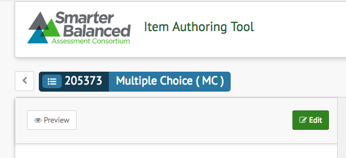

[Go Back](../../README.md)

# Delete an Item From IMRT

An item can be deleted in one of two ways:

1. Delete the item from GitLab directly (either via the UI or an API call)
2. In IAT, an item that is in the "being created" state can be deleted through the IAT UI

After the item has been removed from GitLab, it must also be deleted from the IMRT database.  To delete the item from the IMRT database, take the following steps:

>_**WARNING:** The SQL cited below is destructive - rows will be deleted from the database.  If records are deleted by mistake, the only way to recover them is to restore the database from a backup.  We recommend taking a backup of the database prior to deleting an item from `imrt`._

1. Get the item identifier of the item that was deleted.  The screenshot below shows where the item identifier can be found in the IAT UI: 

	
2. In the SQL below, replace `[item to delete]` on line 2 with the item identifier:

	```sql
	DO $$
	DECLARE item_id varchar := '[item to delete]';
	BEGIN
		DELETE
		FROM item_git AS git
		USING item AS item
		WHERE
			item.id = item_id
			AND git.item_key = item.key;
				
		DELETE
		FROM stim_link AS stim
		USING item AS item
		WHERE
			item.id = item_id
			AND (stim.item_key = item.key
			OR stim.item_key_stim = item.key);
			
		DELETE
		FROM item_log AS log
		USING item AS item
		WHERE
			item.id = item_id
			AND log.item_key = item.key;
			
		DELETE
		FROM project_lock AS plock
		USING item AS item
		WHERE
			item.id = item_id
			AND plock.project_id = item.key;
			
		DELETE FROM item
		WHERE id = item_id;
	END $$;
	```

3. Execute the SQL to delete the item

## Example
Shown below is an example of SQL that will delete item 42 from the `imrt` database:

```sql
DO $$
DECLARE item_id varchar := '42';
BEGIN
	DELETE
	FROM item_git AS git
	USING item AS item
	WHERE
		item.id = item_id
		AND git.item_key = item.key;
			
	DELETE
	FROM stim_link AS stim
	USING item AS item
	WHERE
		item.id = item_id
		AND (stim.item_key = item.key
		OR stim.item_key_stim = item.key);
		
	DELETE
	FROM item_log AS log
	USING item AS item
	WHERE
		item.id = item_id
		AND log.item_key = item.key;
		
	DELETE
	FROM project_lock AS plock
	USING item AS item
	WHERE
		item.id = item_id
		AND plock.project_id = item.key;
		
	DELETE FROM item
	WHERE id = item_id;
END $$;
```
