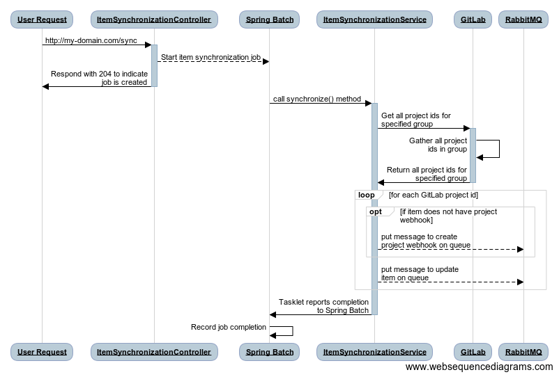

# Item Synchronization Process

## Overview
The Item Synchronization Process is responsible for ensuring that the IMRT database (which the [Item Search Service](https://github.com/SmarterApp/AP_IMRT_ItemSearchService) relies on) reflects the item data stored in source control.  The Item Synchronization Process iterates over every project in source control and executes the ingest process for each one.  When the Item Synchronization Process is complete, the IMRT database will accurately reflect the items stored in source control.

## Implementation

Shown below is a sequence diagram describing how the job works:



***NOTE:*** The message listener that intercepts the messages put on the queue by the Item Synchronization Process has been omitted for clarity.  The message listener functions exactly the same way here as it does during the normal ingest process.

## Configuration
The item synchronization process is part of the [AP\_IMRT\_ItemIngestService](https://github.com/SmarterApp/AP_IMRT_ItemIngestService), thus shares its configuration properties.  Refer to the AP\_IMRT\_ItemIngestService `README.md` for details on configuration options.

As previously stated, the Item Synchronization Process relies on Spring Batch.  There are two settings specific to Spring Batch that need to be configured:

* Prevent Spring Batch from starting the Item Synchronization Process whenever the Item Ingest Service starts up
* Prevent Spring Batch from trying to create its database schema on startup (these tables are created as part of the [AP\_IMRT\_Schema project](https://github.com/SmarterApp/AP_IMRT_Schema))

These configuration settings are detailed below:

```yaml
spring:
  batch:
    job:
      enabled: false # Prevent Spring from starting jobs on startup.
    initialize-schema: "never" # Prevent Spring from creating the spring batch schema on startup.
```

## Execution
To execute the Item Synchronization Process, create a `POST` call to the `/sync` endpoint of the Item Ingest Service.  An example of such a call is shown below:

```
curl -i -X POST "http://ap-imrt-iis-service/sync"
```

**NOTE:** The call shown above uses the name of the Item Ingest Service that Kubernetes recognizes.  That is, Kubernetes has a service named `ap-imrt-iis-service`.  For additional details on Kubernetes services, refer to [this page](https://kubernetes.io/docs/concepts/services-networking/service/).

### Execution Outside of the Kubernetes Environment
The item synchronization process can be called from outside the Kubernetes environment, follow these steps:

* Get a bearer token from OpenAM:

```
curl -i -X POST \
   -H "Content-Type:application/x-www-form-urlencoded" \
   -d "grant_type=password" \
   -d "username=[a user account registered within openam]" \
   -d "password=[password for user specified in 'username' field]" \
   -d "client_id=[client id registered in OpenAM]" \
   -d "client_secret=[client secret for client id]" \
 'https://[OpenAM domain]/auth/oauth2/access_token?realm=%2Fsbac'
```

  * The result will appear similar to what follows:
  
  ```json
  {
      "scope": "cn givenName mail sbacTenancyChain sbacUUID sn",
      "expires_in": 35999,
      "token_type": "Bearer",
      "refresh_token": "[redacted]",
      "access_token": "[redacted]"
  }
  ```

* Pass the `access_token` acquired from the previous step in header of the `POST` to the Item Ingest Service:

```
curl -i -X POST -H "Authorization: Bearer [access_token from previous step]" "http://[IMRT Item Ingest Service domain]/sync"
```

### Automating Item Synchronization Process Execution
The Item Synchronization Process can be scheduled to run at regular intervals (e.g. nightly after regular production hours).  A cron job can be created in the IMRT Kubernetes environment.  Shown below is an example of a cron job that configures the Item Synchronization Process at 9:00 AM UTC:

```yaml
apiVersion: batch/v1beta1
kind: CronJob
metadata:
  name: sync-job
spec:
  # Schedule to run at 9am UTC each day
  schedule: "0 9 * * *"
```

## Monitoring
The item synchronization process writes information about its progres to the application's log file.  To monitor the item synchronization process as it runs, take the following steps, tail the log file on the Item Ingest Service pod in the Kubernetes cluster:

* Identify the Item Ingest Service pod: 

```
$ kubectl get po | grep iis
ap-imrt-iis-deployment-65c4cf5454-zrvs9     1/1       Running   0          3d

```

* Tail the log file of the Item Ingest Service pod identified in the previous step:

```
$ kubectl logs -f ap-imrt-iis-deployment-65c4cf5454-zrvs9
```

At this point, the pod's log file is being followed and details of the item synchronization process will be displayed.  The log entries that signify the item synchronization process has started will appear similar to what is shown below:

```
2018-04-23 23:16:16.915  INFO 1 --- [cTaskExecutor-1] o.s.b.c.l.s.SimpleJobLauncher            : Job: [SimpleJob: [name=itemSynchronizationJob]] launched with the following parameters: [{}]
2018-04-23 23:16:17.007  INFO 1 --- [cTaskExecutor-1] o.s.b.c.j.SimpleStepHandler              : Executing step: [itemSynchronizationStep]
```

To get additional details written to the log file, update the configuration for Item Ingest Service to use the `DEBUG` level:

```yaml
logging:
  level:
    org.opentestsystem: DEBUG
```

## Troubleshooting
