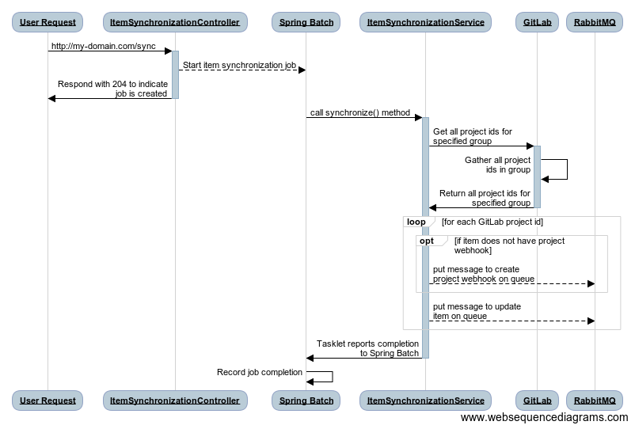

# Item Synchronization Process

[Go Back](Architecture.md)

## Overview
The Item Synchronization Process is responsible for ensuring that the IMRT database (which the [Item Search Service](https://github.com/SmarterApp/AP_IMRT_ItemSearchService) relies on) reflects the item data stored in source control (e.g. GitLab).  The Item Synchronization Process iterates over every item (referred to as a "project" in GitLab) in source control and executes the ingest process for each one.  When the Item Synchronization Process is complete, the IMRT database will accurately reflect the items stored in source control.

## Architecture/Implementation
The Item Synchronization Process is a [Spring Batch](https://projects.spring.io/spring-batch/) job with a single step.  The details of the operations performed by the step are described in the **Workflow** section below.

### Workflow
The Item Synchronization process is initiated by an `HTTP POST` request to the `sync` endpoint of the Item Ingest Service.  The `sync` endpoint does not accept any arguments.  After the `POST` to `sync` is received, the following steps occur:

1. The `ItemSynchronizationController` will start a new instance of the Item Synchronization Process job
2. The Item Synchronization Process job is started asynchronously by a Spring Batch `JobLauncher`
3. The `ItemSynchronizationService#synchronize` method is called, which does the following:
    1. Fetch all project ids (GitLab's unique identifier for an item) from GitLab for the configured Project Group
    2. For each project id:
        1.  Determine if the item has a project webhook created.  If not, put a "monitor item" message on the RabbitMQ queue
        2. Put an "update item" message on the RabbitMQ queue

Once the messages have been put on the RabbitMQ queue, the Item Synchronization Process is complete.  The Item Ingest Process will read each message, evaluate it and perform the appropriate action:

* **Monitor Item:** This message will use the GitLab API library (implemented in the [AP\_IMRT\_ItemIngestService](https://github.com/SmarterApp/AP_IMRT_ItemIngestService/blob/develop/src/main/java/org/opentestsystem/ap/imrt/iis/client/GitlabClientImpl.java)) to create a new project webhook for the item.
* **Update Item:** This message will verify the item records in the `imrt` database are up-to-date with the most recent revision for the item.  If the item does not exist in the database, new records will be created.

Shown below is a sequence diagram of the steps described above:



***NOTE:*** The message listener that intercepts the messages put on the queue by the Item Synchronization Process has been omitted for clarity.

### Database
Aside from the [Spring Batch metadata tables](https://docs.spring.io/spring-batch/trunk/reference/html/metaDataSchema.html), the Item Synchronization Process does not rely on any special database objects.  The Spring Batch metadata tables are used to track the Item Synchronization Process's execution, progress, status, etc.

### Restrictions
There can only be one instance of the Item Synchronization Process job running at one time

## Configuration
The item synchronization process is part of the [AP\_IMRT\_ItemIngestService](https://github.com/SmarterApp/AP_IMRT_ItemIngestService), thus shares its configuration properties.  Refer to the AP\_IMRT\_ItemIngestService `README.md` for details on configuration options.

As previously stated, the Item Synchronization Process relies on Spring Batch.  There are two settings specific to Spring Batch that need to be configured:

* Prevent Spring Batch from starting the Item Synchronization Process whenever the Item Ingest Service starts up
* Prevent Spring Batch from trying to create its database schema on startup (these tables are created as part of the [AP\_IMRT\_Schema project](https://github.com/SmarterApp/AP_IMRT_Schema))

These configuration settings are detailed below:

```yaml
spring:
  batch:
    job:
      enabled: false # Prevent Spring from starting jobs on startup.
    initialize-schema: "never" # Prevent Spring from creating the spring batch schema on startup.
  # other spring-related settings here...
```

The Spring Batch configuration settings described above will typically be included in the `yml` file served up by IMRT's Spring Cloud Configuration service.  When working in a local development environment (e.g. running the Item Ingest Service in IntelliJ), the settings can be included in an `application.yml` file.

## Execution
To execute the Item Synchronization Process, create a `POST` call to the `/sync` endpoint of the Item Ingest Service.  An example of such a call is shown below:

```
curl -i -X POST "http://ap-imrt-iis-service/sync"
```

The call shown above uses the name of the Item Ingest Service that Kubernetes recognizes.  That is, the IMRT Kubernetes environment has a service named `ap-imrt-iis-service`.  For additional details on Kubernetes services, refer to [this page](https://kubernetes.io/docs/concepts/services-networking/service/).  To execute the Item Synchronization Process from outside the IMRT Kubernetes environment, refer to the next section.

### Execution Outside of the Kubernetes Environment
The item synchronization process can be called from outside the Kubernetes environment, follow these steps:

* Get a bearer token from OpenAM:

	```
	curl -i -X POST \
	   -H "Content-Type:application/x-www-form-urlencoded" \
	   -d "grant_type=password" \
	   -d "username=[a user account registered within openam]" \
	   -d "password=[password for user specified in 'username' field]" \
	   -d "client_id=[client id registered in OpenAM]" \
	   -d "client_secret=[client secret for client id]" \
	 'https://[OpenAM domain]/auth/oauth2/access_token?realm=%2Fsbac'
    ```

* The response will appear similar to this:
  
	```json
	{
	  "scope": "cn givenName mail sbacTenancyChain sbacUUID sn",
	  "expires_in": 35999,
	  "token_type": "Bearer",
	  "refresh_token": "[redacted]",
	  "access_token": "[redacted]"
	}
	```

* Pass the `access_token` acquired from the previous step in header of the `POST` to the Item Ingest Service:

	```
	curl -i -X POST -H "Authorization: Bearer [access_token from previous step]" "http://[IMRT Item Ingest Service domain]/sync"
	```

Example:

```
curl -i -X POST -H "Authorization: Bearer a-bearer-token-uuid" "http://imrt-example.com/sync"
```

### Automating Item Synchronization Process Execution
The Item Synchronization Process can be scheduled to run at regular intervals (e.g. nightly after regular production hours).  A cron job can be created in the IMRT Kubernetes environment.  Shown below is an example of a cron job that configures the Item Synchronization Process at 9:00 AM UTC:

```yaml
apiVersion: batch/v1beta1
kind: CronJob
metadata:
  name: sync-job
spec:
  # Schedule to run at 9am UTC each day
  schedule: "0 9 * * *"
```

## Monitoring
The item synchronization process writes information about its progres to the application's log file.  To monitor the item synchronization process as it runs, take the following steps, tail the log file on the Item Ingest Service pod in the Kubernetes cluster:

* Identify the Item Ingest Service pod: 

	```
	$ kubectl get po | grep iis
	ap-imrt-iis-deployment-65c4cf5454-zrvs9     1/1       Running   0          3d
	
	```

* Tail the log file of the Item Ingest Service pod identified in the previous step:

	```
	$ kubectl logs -f ap-imrt-iis-deployment-65c4cf5454-zrvs9
	```

At this point, the pod's log file is being followed and details of the item synchronization process will be displayed.  The log entries that signify the item synchronization process has started will appear similar to what is shown below:

```
2018-04-23 23:16:16.915  INFO 1 --- [cTaskExecutor-1] o.s.b.c.l.s.SimpleJobLauncher            : Job: [SimpleJob: [name=itemSynchronizationJob]] launched with the following parameters: [{}]
2018-04-23 23:16:17.007  INFO 1 --- [cTaskExecutor-1] o.s.b.c.j.SimpleStepHandler              : Executing step: [itemSynchronizationStep]
```

To get additional details written to the log file, update the configuration for Item Ingest Service to use the `DEBUG` level:

```yaml
logging:
  level:
    org.opentestsystem: DEBUG
```

## Troubleshooting
The Item Synchronization Process job may occasionally fail before completing.  For example, the Kubernetes pod hosting the process is restarted before the Item Synchronization Process job finishes.  If this happens, the Spring Batch metadata tables will indicate the job is still in progress.  The SQL below can be used to identify and update the job step and job execution that are not completed:

***NOTE:***  Perform a backup of the `imrt` database prior to executing _any_ of the `UPDATE` or `DELETE` statements below.

```sql
-- ----------------------------------------------------------------------
-- Identify records in the batch_step_execution table that do not have a 
-- status and exit_code == COMPLETED
-- ----------------------------------------------------------------------
SELECT
	step_execution_id,
	job_execution_id,
	status,
	exit_code,
	start_time,
	end_time, 
	last_updated
FROM
	batch_step_execution 
WHERE
	status <> 'COMPLETED' 
	OR exit_code <> 'COMPLETED';
	
-- ----------------------------------------------------------------------
-- Update the batch_step_execution table, indicating the job has finished
-- executing.
-- ----------------------------------------------------------------------
UPDATE
	batch_step_execution
SET
	status = 'COMPLETED',
	exit_code = 'COMPLETED'
WHERE
	step_execution_id = -- [the step_execution_id of the record that is incomplete]

-- ----------------------------------------------------------------------
-- Update the batch_job_execution table, indicating the job has finished
-- executing.
-- ----------------------------------------------------------------------
UPDATE
	batch_job_execution
SET
	status = 'COMPLETED',
	exit_code = 'COMPLETED'
WHERE
	job_execution_id = -- [the job_execution_id of the record that is incomplete]
```

If the SQL cited above does not resolve this issue, delete records from the Spring Batch metadata tables:

```sql
DELETE FROM batch_step_execution_context;
DELETE FROM batch_step_execution;
DELETE FROM batch_job_execution_context;
DELETE FROM batch_job_execution_params;
DELETE FROM batch_job_execution;
DELETE FROM batch_job_instance;
```
